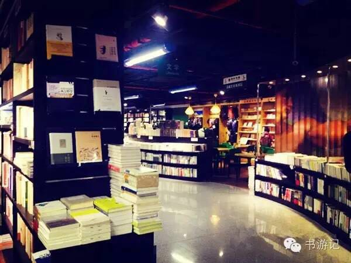
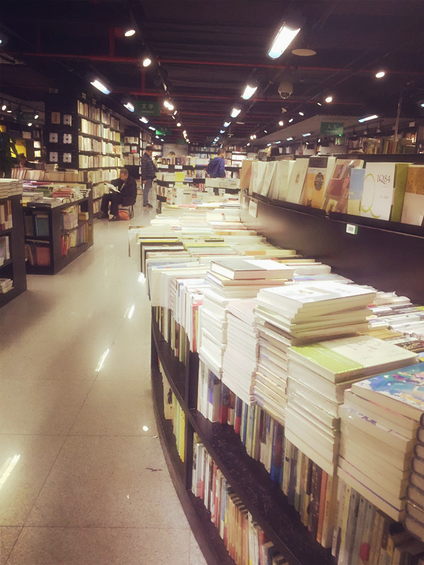
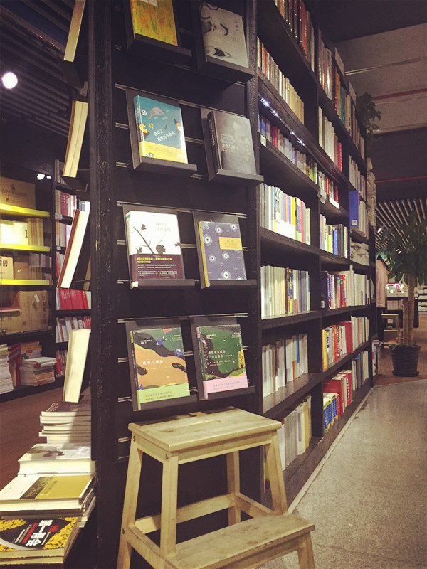
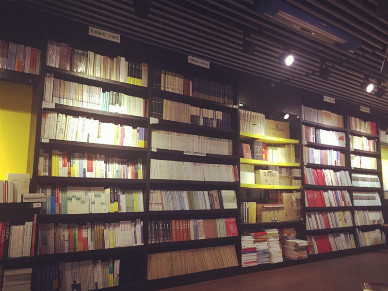
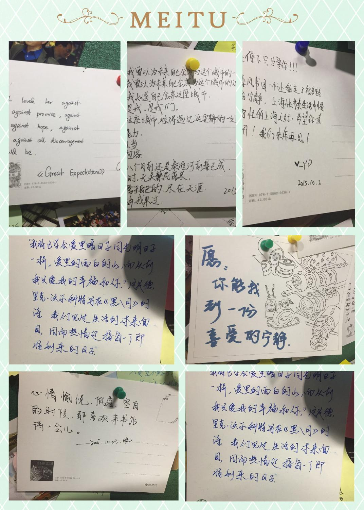

季风书园| 城市·书店·一个旧梦

 

一直很想就独立书店做一个选题，把所见、所拍、所感的书店故事记录下来。
这个想法，大概从两年前第一次迈步到季风书园就有了。  

>偶遇

最开始是坐地铁经过陕西南路，发现地铁站里有间书店，进去逛了逛，发现没啥，但因为独特的地理位置记住了。
后来去上图下地铁时发现原来这里也有一间季风书园，店里的装修布局以及书架灯光都挺合我心意，重要的是，我发现在里面能找到很多好书，所以留了下来。

（季风书店一角）

 
>历史

直到去年无意中看到报道，我一直都不知道原来上图店是季风的总店，也是这家辉煌时期曾有8间分店的独立书店最后仅存的“果实”，看新民晚报报道季风陕西南路店因为店租与商家的争端，无法续租，莫名觉得伤感。
所以越发去的频繁，有时也在里面买书，算是一个小读者的小小支持。

>书语

季风内的书很全，以人文社科居多，无论是历史、文学爱好者、哲学迷、法律从业者、经济金融等等，都一应俱全。  

（店内格局）

 

很遗憾的是，在互联网新媒体时代，不肖说报纸和杂志失去了大批的受众，就连纸质书，也生存境况艰难。
看到李良荣老师在上海观察刊文，《新媒体时代的老传统》，深有感触。在时代变迁之际，在新媒体给我们带来海量与移动的讯息同时，

>读者墙上的留言

还是希望人们，能在每一周抽出固定的时间，来看看纸质书，逛逛书店。
我想，与其说是书店之为书店，不如说是一种文化，一种思考方式。弥足珍贵。希望它不要消失。
我想就像波兹曼所说：我们应该保有这样一种习惯，有些传统，是值得坚持的。

文/ 波波

